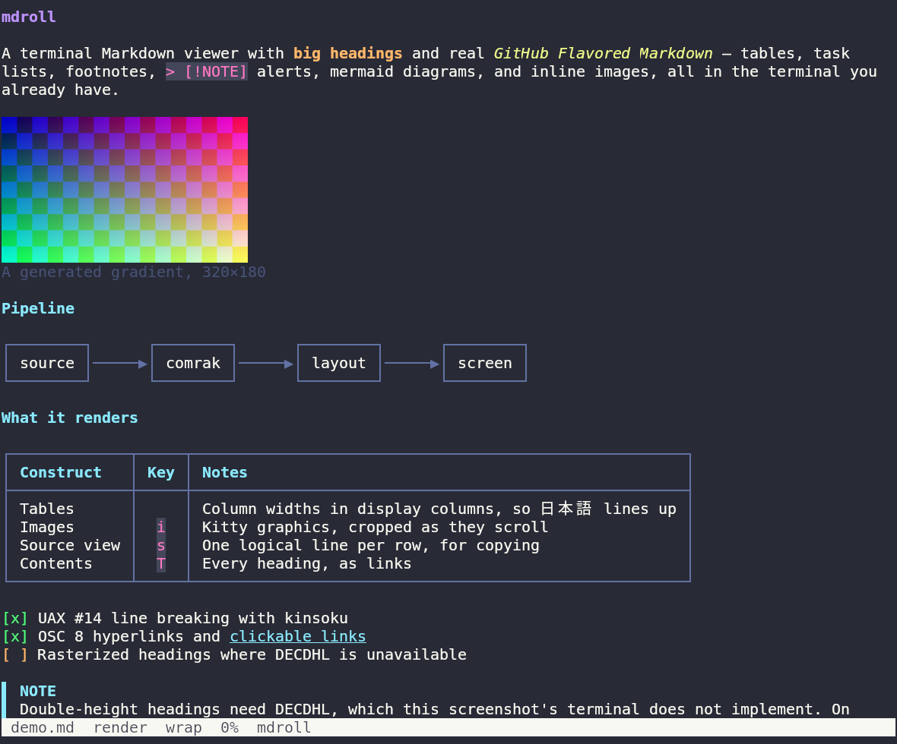
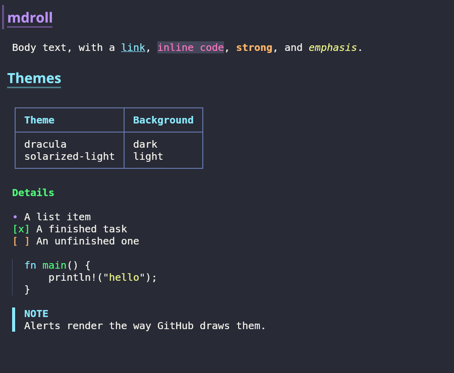
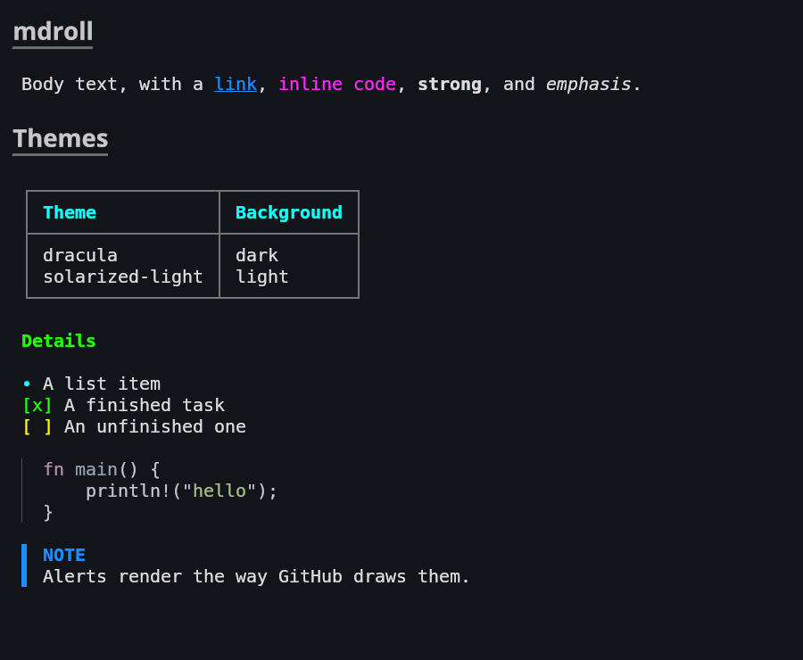
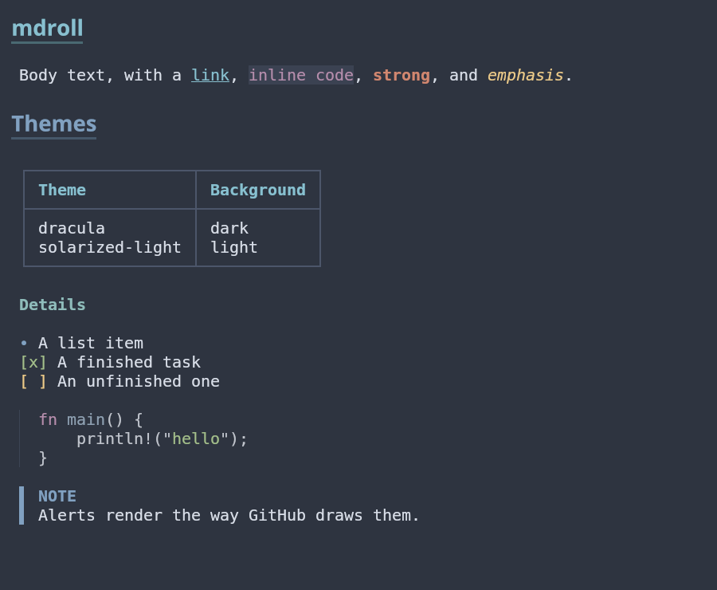
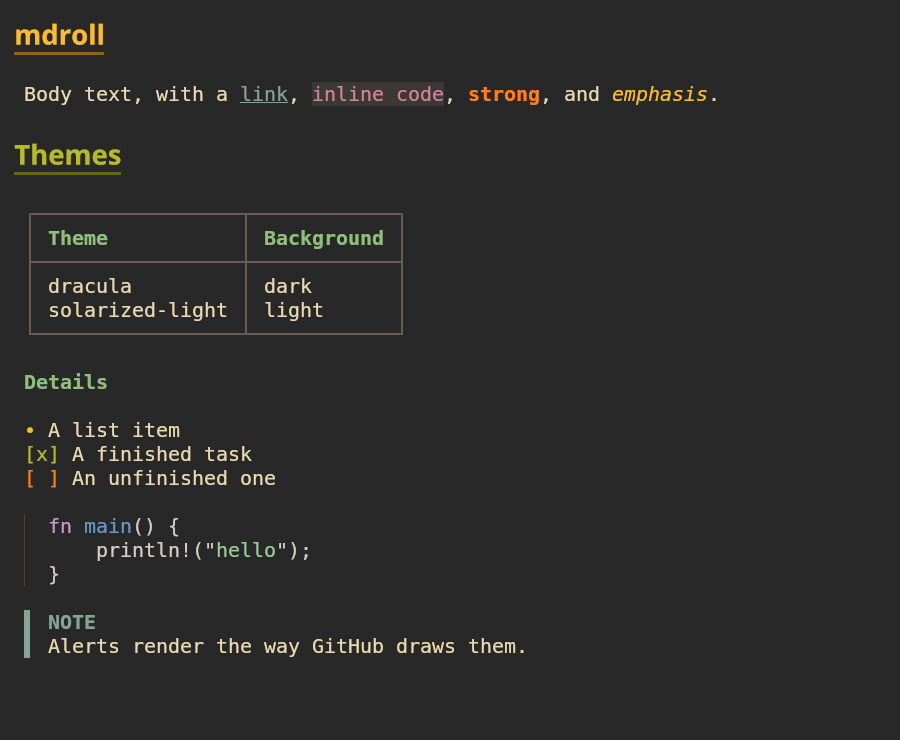
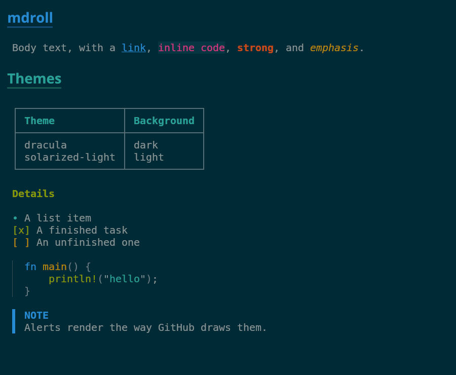
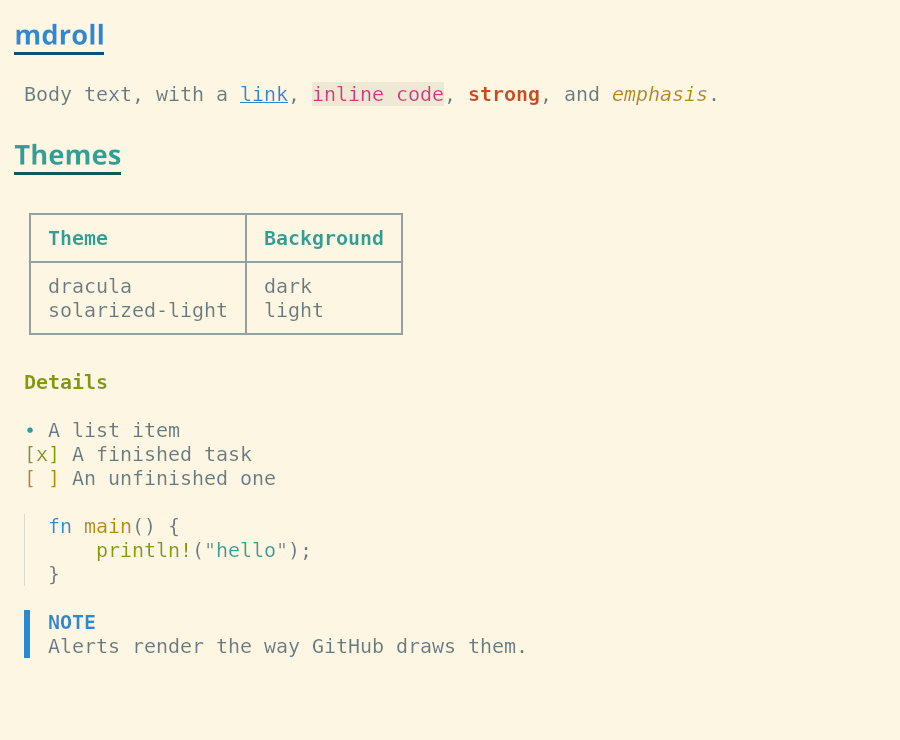

# mdroll

A terminal Markdown viewer with big headings and real GitHub Flavored Markdown
support.

`mdroll` renders Markdown in the terminal the way GitHub does — tables, task
lists, footnotes, alerts, and mermaid diagrams included — with a
horizontal-scroll mode for when you don't want reflow, and a source view you can
toggle into at any time. Headings are actually *big*, not just a different
color.

The name is `md` + *roll*, after 絵巻 (emaki), the horizontal picture scrolls you
read by unrolling sideways.



<sub>Rendering `doc/demo.md` with the Dracula theme, captured in kitty. The
headings — including the Japanese one — are bitmaps rather than DECDHL,
because kitty has graphics but no double-height lines. See
[Terminal support](#terminal-support).</sub>

---

## Why

Existing terminal Markdown viewers are good, but three things kept coming up:

1. **Headings never look like headings.** Every viewer renders `# Title` in a
   color or a background bar. None of them make the text larger, so document
   structure is hard to scan.
2. **GitHub's Markdown is the Markdown people actually write.** Task lists,
   footnotes, `> [!NOTE]` alerts, and mermaid diagrams appear in every README,
   and most viewers render them as raw text or drop them entirely.
3. **You can't get the text back out.** Once content is rendered, copying the
   original Markdown means opening the file in an editor.

`mdroll` targets these directly. It is built for **WezTerm** first; other
terminals work, but features that depend on terminal capabilities degrade
gracefully rather than being the design center.

---

## Features

- **Everything GitHub renders** — tables, task lists, strikethrough, autolinks,
  footnotes, `> [!NOTE]` alerts, `:rocket:` emoji, and definition lists. Not
  just the five extensions the GFM spec defines, and nothing GitHub does not
  have — see [What counts as Markdown here](#what-counts-as-markdown-here).
- **The HTML in your README** — centred logos, badge rows, `<details>`
  sections, `<kbd>` keys, HTML tables and lists, all rendered rather than
  dumped as tags.
- **The pictures in your README** — logos and badge rows drawn as pictures,
  including the SVG ones, and including the ones behind an `https://` URL.
- **Mermaid diagrams** — `flowchart` and `sequenceDiagram` drawn with box
  characters, laid out by rank. Anything else goes through `mmdc` and renders
  as a picture, if you have it installed.
- **Two rendering modes** — rendered view, and raw source view showing `#`,
  `**`, and friends as written.
- **Two layout modes** — reflow to terminal width, or no-wrap with horizontal
  scrolling.
- **Big headings** — DECDHL double-height lines where they work, and text
  rasterized to a bitmap where the terminal has graphics instead.
- **Correct CJK line breaking** via UAX #14, with kinsoku rules applied.
- **Block yank** — move a cursor over blocks and copy either the original
  Markdown source or the rendered plain text. Works over SSH via OSC 52.
- **Clickable links** via OSC 8 hyperlinks, with no mouse capture required, so
  your terminal's native text selection keeps working.
- **Bundled themes** — Dracula, Solarized Dark/Light, Nord, Gruvbox, selectable
  from the command line.
- **Single binary**, installable with `mise`.

---

## Installation

### mise

```toml
# mise.toml
[tools]
"github:tokuhirom/mdroll" = "latest"
```

```console
$ mise install
```

### cargo

```console
$ cargo install --locked --git https://github.com/tokuhirom/mdroll
```

### From source

```console
$ git clone https://github.com/tokuhirom/mdroll
$ cd mdroll
$ cargo build --release
```

Prebuilt binaries are attached to each
[release](https://github.com/tokuhirom/mdroll/releases): macOS on Apple
silicon, Linux on x86-64 and arm64, and Windows on x86-64. `mise` picks the
right one for your machine automatically. Intel Macs build from source.

---

## Usage

```console
$ mdroll README.md
$ cat README.md | mdroll
$ mdroll                      # browse *.md from the current directory
$ mdroll README.md | less -R  # piped output renders once and exits
```

When stdout is not a terminal, `mdroll` renders the whole document to stdout and
exits instead of trying to page it — the same thing a pager does when it is not
on a terminal.

### Options

| Option | Description |
| --- | --- |
| `--theme <NAME\|PATH>` | Color theme, by name or by path to a `.toml` file. Default: `terminal` (uses your terminal's own colors). |
| `--list-themes` | Print available theme names and exit. |
| `--dump-theme <NAME\|PATH>` | Write a theme out as TOML and exit. A starting point for your own. |
| `--wrap` / `--no-wrap` | Start in reflow or horizontal-scroll mode. |
| `--source` | Start in source view instead of rendered view. |
| `--width <N>` | Cap the reflow width. `0` means full terminal width. |
| `--margin <N>` | Blank columns to keep on each side. Default `2`. |
| `--status` / `--no-status` | Show a persistent status line instead of transient toasts. |
| `--mouse` | Enable mouse capture (needed for image click actions). Off by default. |
| `--no-images` | Disable inline image rendering. |
| `--no-remote-images` | Never fetch images over the network; show their alt text instead. |
| `--graphics <MODE>` | `auto`, `kitty`, or `none`. Default `auto`, which asks the terminal. |
| `--no-color` | Plain output, no ANSI styling. |
| `--mermaid <MODE>` | `auto`, `text`, or `image`. Default `auto`. |
| `--watch` | Reload automatically when the file changes on disk. |
| `-z`, `--no-big-headings` | Never draw headings at double size, by either method. |
| `--ambiguous-wide` | Treat East Asian Ambiguous characters as two columns. |
| `--config <PATH>` | Use an alternate config file. |

`mdroll --man > mdroll.1` writes a man page, generated from the same definition
the argument parser uses so it cannot drift.

Environment variables: `MDROLL_THEME`, `MDROLL_CONFIG`, `NO_COLOR`, and
`VISUAL` or `EDITOR` for the `v` key.

Precedence is **command line → environment → config file → built-in default**.

---

## Modes

`mdroll` has two independent, orthogonal mode axes:

|  | **Wrap** | **No-wrap** |
| --- | --- | --- |
| **Render** | Reflowed, styled output. The default. | Styled output, horizontal scrolling. Good for wide tables. |
| **Source** | Raw Markdown, reflowed. | Raw Markdown, one logical line per row. Best for copying. |

Toggling into source view automatically switches to no-wrap, and restores your
previous wrap setting on the way back. This matters: dragging a selection across
reflowed text inserts hard line breaks into whatever you copy. In no-wrap source
view, one logical line stays on one row, so your terminal's native selection
gives you the text exactly as written.

---

## Key bindings

### Navigation

| Key | Action |
| --- | --- |
| `j` / `↓` | Scroll down one line |
| `k` / `↑` | Scroll up one line |
| `d` | Half page down |
| `u` | Half page up |
| `f` / `Space` / `PgDn` | Page down |
| `b` / `PgUp` | Page up |
| `g` | Jump to top |
| `G` | Jump to bottom |
| `h` / `←` | Scroll left (no-wrap mode) |
| `l` / `→` | Scroll right (no-wrap mode) |
| `0` | Reset horizontal scroll |

### Modes

| Key | Action |
| --- | --- |
| `w` | Toggle wrap / no-wrap |
| `s` | Toggle rendered / source view |
| `t` | Cycle theme |
| `z` | Toggle big headings |
| `i` | Toggle inline images |

### Copying

| Key | Action |
| --- | --- |
| `Tab` | Move block cursor forward |
| `Shift-Tab` | Move block cursor backward |
| `yy` | Yank block as Markdown source |
| `Y` | Yank block as rendered plain text |
| `yc` | Yank code block contents only, without the fences |
| `V` | Line selection mode — extend with `j`/`k`, confirm with `y` |
| `yp` | Yank the file path |

### Links and search

| Key | Action |
| --- | --- |
| `F` | Link picker — label every link, jump by keystroke |
| `o` | Open the link under the block cursor |
| `/` | Search forward |
| `?` | Search backward |
| `n` / `N` | Next / previous match |

### Other

| Key | Action |
| --- | --- |
| `r` | Reload the file |
| `v` | Open `$EDITOR` at the line on screen, then reload |
| `T` | Table of contents |
| `H` | Show help |
| `q` / `Esc` | Quit |

Links are also emitted as OSC 8 hyperlinks, so `Cmd`-click (macOS) or
`Ctrl`-click opens them directly through the terminal without `mdroll` capturing
the mouse.

---

## Terminal support

WezTerm is the reference. Everything works everywhere; the features below are
the ones that depend on what the terminal can actually do.

| Feature | Works on | Elsewhere |
| --- | --- | --- |
| Inline images | WezTerm, kitty, ghostty | Alt text, dimmed |
| Big headings, via DECDHL | WezTerm, xterm, foot | see below |
| Big headings, rasterized | kitty, ghostty | Colour and weight only |
| Heading borders and bars, free | kitty, ghostty | Drawn as text; the rule costs a row |
| Clickable links (OSC 8) | Most modern terminals | Use `F` or `o` instead |
| Clipboard over SSH (OSC 52) | Most modern terminals | Enable it in your terminal |
| Truecolor | `COLORTERM=truecolor` | Nearest 256-color match |

### Over ssh

Graphics work over `ssh`. The escape sequences travel down the connection like
any other output, and the terminal drawing them is the one in front of you.

What does not travel is the environment. `WEZTERM_PANE`, `KITTY_WINDOW_ID` and
friends are set by a terminal on the machine it runs on, so a viewer on the
far end that goes looking for them concludes there is nothing there. `mdroll`
therefore asks the terminal instead, at startup, with a graphics query followed
by a Device Attributes request — every terminal answers the second one, and
replies come back in order, so a DA reply with no graphics reply ahead of it
means no. The same round trip asks for the cell size, which `TIOCGWINSZ` also
cannot report across a connection.

If a terminal answers neither, `--graphics kitty` says to draw anyway:

```toml
graphics = "kitty"
```

### Multiplexers

`tmux` rewrites both graphics escapes and line attributes, so `mdroll` turns
inline images and double-height headings off when `TMUX` is set rather than
emitting sequences that would arrive mangled.

[herdr](https://github.com/ogulcancelik/herdr) passes the Kitty graphics
protocol through, but only when you opt in. Add this to your herdr config, or
images will fall back to alt text:

```toml
[experimental]
kitty_graphics = true
```

### Images

A paragraph that holds nothing but pictures is a figure: one logo on its own,
or a whole row of badges laid out side by side and wrapped when the row fills
up. A lone figure keeps its alt text as a caption; a badge row does not, since
the badges say it themselves. `` and `` are honoured,
which is what stops a logo authored at 1300 pixels wide from filling the
terminal. A picture wrapped in a link opens the link — `o` on a badge goes to
the build, not to a PNG of a build's state.

SVG is rasterized through [resvg](https://github.com/linebender/resvg) at the
size it will be displayed at, so a logo is as sharp as the terminal's cells
allow. Badge text needs fonts, which are taken from the system.

Images behind an `http(s)` URL are fetched on worker threads and cached under
`~/.cache/mdroll/images`, keyed by URL. The document is drawn immediately with
alt text where the pictures will go, and each one replaces its text as it
lands; a second look at the same document is instant and works offline.

Entries are dropped a week after they were written, and fetched again the next
time they are wanted. Time since *writing*, not since last use: a build badge
that never expired would show the same state forever, and being a week out of
date is the failure this is meant to bound.

The cache is a record of which documents have been opened and what they pointed
at, so on Unix it is kept to its owner: `~/.cache/mdroll` and everything under
it are `0700`, and downloads land as `0600`. A directory left open by an older
version is narrowed on the next run.

Opening a document means talking to whichever hosts it points at, so:

```console
$ mdroll --no-remote-images README.md   # once
```

```toml
remote_images = false                   # always
```

Nothing is fetched when stdout is not a terminal, so `mdroll README.md | head`
never touches the network. `data:` and `file:` URLs are not fetched at all.

### Mermaid

Box drawings handle `flowchart` and `sequenceDiagram`. Everything else — pie
charts, Gantt charts, state diagrams, subgraphs, anything cyclic — needs a real
renderer, which means [mermaid-cli](https://github.com/mermaid-js/mermaid-cli):

```console
$ mise use -g npm:@mermaid-js/mermaid-cli
$ npx puppeteer browsers install chrome-headless-shell
```

With `mmdc` on `PATH` and a terminal that has graphics, those diagrams render as
pictures. Without it they show as source. `--mermaid image` forces the picture
path even for diagrams box drawings could handle; `--mermaid text` never runs
`mmdc` at all.

Rendering happens on a worker thread, because starting a browser takes long
enough to feel, and results are cached under `~/.cache/mdroll/mermaid` keyed by
the diagram's content. The box drawings or the source appear immediately and the
picture replaces them when it arrives.

### Cell geometry

Sizing an image in rows needs to know how many pixels a character cell is.
`mdroll` asks the terminal, and falls back to 8×16 if it will not say — which
distorts the aspect ratio slightly but never breaks the layout.

---

## Design

### Pipeline

```
source text
   │
   ▼  comrak (CommonMark + GFM)
  AST ── sourcepos ──┐
   │                 │
   ▼                 │
Vec<Block>  ◄────────┘   intermediate representation
   │
   ▼  layout(&[Block], Viewport, Mode) -> Vec<Line>     ← pure function
Vec<Line>
   │
   ▼  crossterm
 screen
```

### Intermediate representation

```rust
struct Span {
    text: String,
    style: Style,
    link: Option<LinkId>,
}

struct Block {
    source_range: Range<usize>,   // line range in the original file
    kind: BlockKind,              // Heading(u8) | Para | Code | Quote | List | Table | Images
    spans: Vec<Span>,
}

struct Line {
    source_line: usize,
    scale: Scale,                 // Normal | DoubleHeight
    spans: Vec<Span>,
    hits: Vec<Hit>,
}

struct Hit {
    rect: Rect,
    target: HitTarget,            // Link(LinkId) | Image(ImageId)
}
```

Two things carry the whole design:

**`source_range` on every block.** comrak attaches `sourcepos` to each AST node,
giving the start and end position in the original file. Propagating that range
means yanking a block is a slice of the original source, not a reconstruction
from the rendered form. It also lets mode switches preserve your reading
position — the current screen row maps to a source line, and the source line
maps back into whatever the new layout produced. Skipping this early is
expensive to retrofit.

**`layout()` is a pure function.** Wrap/no-wrap toggling, source/render
toggling, and terminal resize are all handled by discarding the layout and
recomputing it. No incremental state, no invalidation logic, no drift.

### What counts as Markdown here

The rule is **what GitHub renders**, which is not the same as the GFM spec.

The spec covers five extensions — tables, task lists, strikethrough, autolinks,
and disallowed raw HTML. GitHub renders considerably more than that: `> [!NOTE]`
alerts, footnotes, `:rocket:` emoji shortcodes, `$...$` math, and YAML front
matter are all GitHub features that no spec mentions. Since the point of this
viewer is to show you the file the way GitHub will, the line is drawn at
GitHub's behaviour rather than at the spec, and those are all on.

The rule cuts the other way too, which matters more. The Markdown parser
underneath, [comrak](https://github.com/kivikakk/comrak), offers extensions
GitHub does not have, and four of them are deliberately **off** because turning
them on changes what an ordinary document means:

| Extension | Syntax | With it on | On GitHub |
| --- | --- | --- | --- |
| `underline` | `__text__` | underlined | **bold** |
| `subscript` | `~text~` | subscript | ~~struck through~~ |
| `superscript` | `^text^` | superscript | literal `^text^` |
| `spoiler` | `\|\|text\|\|` | hidden | literal `\|\|text\|\|` |

The first two are the reason this is a rule and not a preference. `__bold__`
appears in most READMEs, and GFM defines strikethrough as one *or two* tildes —
so `subscript` does not merely diverge from GitHub, it breaks the spec the
project claims to implement. Superscript and subscript are still available the
way they are on GitHub, through `<sup>` and `<sub>`.

Each of the four has a test pinning the GitHub behaviour, so re-enabling one
fails the suite rather than quietly changing every document.

### HTML

READMEs are full of HTML that Markdown has no syntax for: centred logos, badge
rows, `<details>` sections, `<sub>` captions. GitHub renders all of it, so
printing the tags is the wrong answer.

`mdroll` parses the subset that appears in hand-written documents — well-nested
tags, quoted or bare attributes, void elements, comments, and the entities
people actually type — and maps it onto the same intermediate representation
Markdown produces. `align="center"` and `text-align` become block alignment,
which Markdown itself cannot express. A logo wrapped in a link inside a
`<picture>` inside a centred paragraph is recognised as what it is, a figure,
and drawn as one.

Two deliberate departures from a browser. A run of `<br>` tags collapses to a
single blank line, because six of them is a spacing hack that would cost six
rows of a terminal. And `<details>` cannot fold, so the summary is shown as a
heading and the contents follow it.

An HTML block that produces nothing renderable falls back to showing its
source, which is still better than showing nothing.

### Front matter

GitHub draws YAML front matter as a table, and that is what makes an ADR
readable in a terminal: `status` and `date` are the first things you want, and
a block of `key: value` is a poor way to read them.

The parser covers the shapes that appear at the top of a document — scalars,
quoted scalars, both spellings of a sequence, comments — and flattens each key
to one row. What it does not cover, it declines: a nested mapping, a block
scalar, an anchor, and the front matter falls back to its own source. That is
the same bargain the HTML subset makes, and it is cheap here because front
matter is only ever displayed. The cost of not understanding something is that
you see it as written.

A trailing `#` is left alone rather than treated as a comment, because
`title: C# in 2026` is a value and there is no way to tell from the outside.

### Text measurement

Display width comes from `unicode-width`. The East Asian Ambiguous class is
configurable, because whether `─` or `→` occupies one column or two depends on
the terminal's own setting. For WezTerm, match it to your config:

```lua
-- ~/.wezterm.lua
treat_east_asian_ambiguous_width_as_wide = true
```

Line breaking uses `unicode-linebreak` (UAX #14) plus kinsoku adjustments: no
line may begin with `。、）」』ー` and none may end with `「（『`. Text without
spaces has to break somewhere, and these rules are what keep the result from
looking wrong.

### Horizontal scrolling

The horizontal offset is stored in **display columns**, never in bytes or
`char` counts. Slicing a line walks it accumulating width; when a full-width
character straddles the boundary, it is replaced with a single space. Getting
this rule wrong produces a one-column drift that compounds across the document.

### Screen layout and the status line

The terminal height is decremented in exactly one place, and the result has its
own type so it cannot be confused with the full screen:

```rust
struct Screen { rows: u16, cols: u16 }

impl Screen {
    fn viewport(&self) -> Viewport {
        Viewport { rows: self.rows.saturating_sub(1), cols: self.cols }
    }
    fn status_row(&self) -> u16 { self.rows.saturating_sub(1) }
}
```

`layout()` and all scroll arithmetic take a `Viewport`. Only the top-level draw
function sees a `Screen`.

The status line is drawn **last, at an absolute position**, after the content:

```
clear → draw content → MoveTo(0, status_row) → draw status
```

Because it overwrites whatever is there, a content region that miscounts by a
row cannot hide it. Autowrap (DECAWM) is disabled while the status line is
written, so writing into the bottom-right cell cannot trigger a scroll.

Rendering is a full redraw every frame. A viewer updates rarely, and differential
updates are the usual source of "the status line vanishes sometimes" bugs.

By default, mode changes surface as a **transient toast** on the bottom row for
about 1.5 seconds rather than a permanent status line — it costs no rows at all.
`--status` switches to a persistent line.

### Headings

`#` and `##` are drawn large; `###` and below get colour and weight only. Two
levels is where GitHub stops setting a heading apart structurally as well — it
is the same pair it draws a bottom border under — and a terminal has few rows to
spend, so a document whose every level is double-height reads as no hierarchy at
all.

On terminals supporting DECDHL, such a heading is emitted as double-height text:

```
\e#3Heading      ← top half
\e#4Heading      ← bottom half
```

This consumes two physical rows for one logical line, and halves the usable
column count for that row, so the layout pass must account for both.

Support is narrower than it looks. **kitty does not implement DECDHL** — it
reports `ESC # 3` as a parse error and then draws the line a second time, so a
heading appears twice. Because a terminal that ignores the sequence produces
visibly broken output rather than a graceful no-op, detection is an allowlist
rather than a denylist: WezTerm, xterm, and foot get double-height headings, and
everything else gets colour and weight. `-z` forces them off anywhere.

Where DECDHL is unavailable but graphics are not — kitty and ghostty, exactly —
the heading is instead rendered to a bitmap at twice the cell height and placed
with the Kitty graphics protocol over the two rows the layout already reserved.
The layout does not need to know which path was taken: a double-height line
occupies two rows and half the columns either way. The bitmap is transparent
behind the glyphs, so the terminal's own background keeps showing through.

The font comes from `fc-match sans-serif:bold`, falling back to a short list of
usual locations. If nothing is found, big headings are simply not offered.

A bitmap can also be decorated, which text cannot. GitHub gives `h1` and `h2` a
bottom border, and here a rule under the heading costs nothing: the text uses
0.78 of two rows the layout has already reserved, so the line goes in the space
below it rather than on a row of its own. A bar down the left goes in the blank
the margin leaves, and is dropped rather than drawn over the first letter when
there is no blank to put it in.

```toml
[heading]
h1 = { fg = "#bd93f9", bold = true, border = true, bar = true }
h2 = { fg = "#8be9fd", bold = true, border = "#6272a4" }   # explicit colour
h3 = { fg = "#50fa7b", bold = true }
```

Every level can carry either. Where the heading becomes a bitmap the two are
painted into it and cost nothing; everywhere else they are drawn as text, which
is what makes them work below the cutoff, on terminals with no graphics, and
under `-z`.

`true` takes the heading's own colour at 55%, which is the default for the two
levels drawn large. Deriving it rather than requiring it written down is the
point: every theme that predates the feature, including any you already have,
shows a border without being edited. Dimming scales the channels rather than
blending towards the background, because `terminal` has no background colour to
blend with.

Unlike colour, decoration does **not** inherit down the levels. A theme naming
only `h1`..`h3` gets `h3`'s colour on `h4`..`h6`, and asking for a bar on `h3`
does not put one on every level beneath it.

The text form differs in what it costs rather than in whether it appears. A bar
is a gutter, the same mechanism as the one down the side of a blockquote, so it
takes a column and the heading reflows around it. A rule has nowhere to go but a
row of its own, because a line of text fills its row from top to bottom and a
terminal cannot underscore it with anything thinner than a character. So the
same document is a row taller per `h1` and `h2` outside kitty and ghostty, where
the bitmap has 0.22 of two already-reserved rows to spend and spends it.

### Clipboard

Local sessions use `arboard`. When `SSH_CONNECTION` is set, or when `arboard`
fails, `mdroll` falls back to OSC 52, which carries text and therefore works for
every yank operation over SSH. Image data cannot be transported this way; on
remote sessions an image yank copies the path instead.

### Themes

Themes are TOML, embedded at build time with `include_str!`. Additional themes
are loaded from `~/.config/mdroll/themes/*.toml`.

```toml
name = "dracula"

[code]
syntect_theme = "Dracula"

[heading]
h1 = { fg = "#bd93f9", bold = true }
h2 = { fg = "#8be9fd", bold = true }
h3 = { fg = "#50fa7b" }

[inline]
link = { fg = "#8be9fd", underline = true }
code = { fg = "#ff79c6", bg = "#44475a" }
```

Two color systems are in play: the UI palette above, and syntect's `.tmTheme`
files for code block highlighting. syntect ships Solarized and the base16 family
but **not** Dracula, so `Dracula.tmTheme` is vendored and referenced by name.

The default theme is `terminal`, which sets no background color and inherits
your terminal's palette. This avoids fighting WezTerm's transparency and
background image settings. Named themes paint backgrounds only when explicitly
selected.

The bundled six, all rendering the same document:

<table>
<tr>
<td width="50%"><b>dracula</b><br></td>
<td width="50%"><b>terminal</b> (default)<br></td>
</tr>
<tr>
<td><b>nord</b><br></td>
<td><b>gruvbox</b><br></td>
</tr>
<tr>
<td><b>solarized-dark</b><br></td>
<td><b>solarized-light</b><br></td>
</tr>
</table>

Captured in kitty, so the headings are bitmaps: `dracula` is the one theme that
uses both decorations, and the rest carry the default border on `h1` and `h2`.

#### Writing one

Start from an existing theme rather than a blank file:

```console
$ mdroll --dump-theme dracula > mine.toml
$ mdroll --theme ./mine.toml README.md
$ mv mine.toml ~/.config/mdroll/themes/     # once you like it
```

`--dump-theme` writes the *resolved* theme: every key the parser reads,
including the ones this theme left at their default. That is the reference — a
key list written out by hand here would be wrong the first time a key was added
and nobody noticed, and a round-trip test asserts that dumping a theme and
reading it back gives the same theme, so the output cannot drift from the code.

`--theme` takes a path as well as a name, so the file can be rendered where it
is being edited instead of being installed after every change. A name and a path
never collide: a name is a file stem under `~/.config/mdroll/themes`, so it
carries neither a separator nor a `.toml` extension. A user theme whose stem
matches a bundled one replaces it, and `--list-themes` shows both.

Every key is optional and absent ones fall back, so a theme can be four lines
long. Two fallbacks are worth knowing:

- `h4`, `h5` and `h6` inherit from the deepest heading level that *was* given,
  so setting `h1`..`h3` styles all six sensibly rather than leaving three of
  them unstyled.
- `foreground` and `background` left unset mean *inherit*, which is what
  `terminal` does deliberately. Setting them is what makes a theme paint over
  your terminal's own palette.

Colors are `#rrggbb`, `#rgb`, a 0-255 palette index, or a name: `red`,
`brightred`, and so on through the sixteen, plus `reset` for the terminal's
default. Note that `white` is the dim one — the bright one is `brightwhite`.

Attributes are `bold`, `italic`, `underline`, `strikethrough`, `dim` and
`reverse`. They only ever go *on*: a style is merged over the default rather
than replacing it, so writing `bold = false` against a key that defaults to bold
does nothing. Nothing in a theme can turn an attribute off, which is why a dump
writes only the ones that are set.

A misspelled section (`[inlnie]`), a misspelled key (`lnik = { … }`) and a
misspelled attribute (`{ blod = true }`) are all errors, and the message for a
key names the ones that section does have:

```console
$ mdroll --theme ./mine.toml README.md
mdroll: in ./mine.toml: unknown key "lnik" in [inline]; valid keys: link, code,
emph, strong, strikethrough, footnote
```

Truecolor is assumed; 256-color terminals get a nearest-color downgrade.

### Configuration

```toml
# ~/.config/mdroll/config.toml

theme = "dracula"
default_mode = "render"        # "render" | "source"
default_wrap = true
width = 100                    # 0 = full terminal width
margin = 2                     # blank columns on each side
status = false                 # false = toast, true = persistent line
double_height_headings = true
images = true
remote_images = true           # fetch images behind an http(s) URL
graphics = "auto"              # "auto" | "kitty" | "none"
mouse = false
east_asian_ambiguous_wide = true
watch = false
mermaid = "auto"                # "auto" | "text" | "image"

[keys]
# Naming an action replaces all of its default bindings. An empty list
# unbinds it.
quit = ["q", "Esc"]
toggle_wrap = ["w"]
half_page_down = ["Ctrl-d"]
contents = []
```

Action names are `quit`, `scroll_down`, `scroll_up`, `half_page_down`,
`half_page_up`, `page_down`, `page_up`, `top`, `bottom`, `scroll_left`,
`scroll_right`, `reset_scroll`, `toggle_wrap`, `toggle_source`, `cycle_theme`,
`toggle_big_headings`, `toggle_images`, `cursor_next`, `cursor_prev`, `yank`,
`yank_rendered`, `select_lines`, `link_pick`, `open`, `search_forward`,
`search_backward`, `next_match`, `prev_match`, `reload`, `edit`, `contents`, and
`help`.
Key specs are a single character, a name such as `Esc`, `Space`, `Tab`,
`Shift-Tab`, `PgDn`, `Home`, or an arrow, optionally prefixed with `Ctrl-` or
`Alt-`.

---

## Roadmap

### v0.1 — Walking skeleton

- [x] comrak parsing into `Vec<Block>` with `source_range`
- [x] Pure `layout()` with reflow
- [x] Vertical scrolling, `Screen`/`Viewport` split
- [x] Absolute-position bottom row, DECAWM handling
- [x] Toast on mode change
- [x] Headings, paragraphs, lists, blockquotes, code blocks (no highlighting)

### v0.2 — Modes

- [x] Source view toggle
- [x] No-wrap mode with horizontal scrolling
- [x] Auto no-wrap when entering source view, restore on exit
- [x] Full-width character handling at slice boundaries

### v0.3 — GitHub Flavored Markdown

- [x] Tables, with column widths measured in display columns
- [x] Task lists and strikethrough
- [x] Autolinks
- [x] Footnotes, with a references section at the end
- [x] `> [!NOTE]` / `[!TIP]` / `[!IMPORTANT]` / `[!WARNING]` / `[!CAUTION]` alerts

### v0.4 — Text quality

- [x] UAX #14 line breaking
- [x] Kinsoku rules
- [x] Configurable East Asian Ambiguous width

### v0.5 — Links

- [x] OSC 8 hyperlink emission
- [x] Link picker (`F`)
- [x] Open under cursor (`o`)

### v0.6 — Copying

- [x] Block cursor (`Tab` / `Shift-Tab`)
- [x] `y` / `Y` / `yc` / `yp`
- [x] Line selection mode (`V`)
- [x] `arboard` with OSC 52 fallback

### v0.7 — Presentation

- [x] Theme loading, bundled themes, `--theme` and `--list-themes`
- [x] syntect code block highlighting
- [x] Config file
- [x] Persistent status line as an option

### v0.8 — Big headings

- [x] DECDHL double-height headings
- [x] Capability detection and graceful fallback
- [x] Layout accounting for halved column count and doubled row cost

### v0.9 — Mermaid

- [x] `flowchart` / `graph` rendered with box drawings, laid out by rank
- [x] `sequenceDiagram` rendered with lifelines and arrows
- [x] Image rendering through `mmdc` where the terminal has graphics
- [x] Fall back to a highlighted code block when neither can draw it

### v0.10 — Finding things

- [x] Incremental search with `/`, `?`, `n`, `N`
- [x] Section breadcrumb, shown in the status line
- [x] Table of contents pane (`T`)

### v0.11 — Images and files

- [x] Inline images via the Kitty graphics protocol
- [x] Optional mouse capture (`--mouse`) with rectangle hit-testing
- [x] File browser when invoked with no arguments
- [x] `r` to reload
- [x] `--watch` for live reload

### v1.0

- [x] Key remapping through config
- [x] Rasterized heading fallback for non-DECDHL terminals
- [x] Release automation, binaries for macOS/Linux/Windows
- [x] Documentation and man page (`mdroll --man > mdroll.1`)

### v1.1 — GitHub parity

- [x] `:rocket:` emoji shortcodes, with unknown codes left as written
- [x] Definition lists
- [x] Math shown as its LaTeX source, since a terminal cannot typeset it
- [x] comrak extensions GitHub does not have turned off, with tests pinning
      `__bold__` and single-tilde `~strikethrough~` to GitHub's reading

### v1.2 — Corrections

Known defects, found by reading the code against this document. Each one is
small on its own; they are collected here so the list is somewhere other than an
issue tracker nobody reads.

- [x] The contents pane draws its links against the *main* document's link
      table, because the draw path checks only for the help pane and not for the
      contents pane the way `active_doc` does. Ctrl-clicking an entry therefore
      opens an unrelated URL. `o` and `F` take the other path and are correct.
- [x] Every link-picker label is placed at the column of the *first* link on its
      row, so a badge row gets its labels stacked in one spot and only the last
      one drawn is visible. The hit rectangles already carry the right column.
- [x] Only the first 26 links can be labelled, and the ones past that are not
      mentioned, which reads as the picker having missed them.
- [x] `y` on its own does nothing: the yank needs `yy`, and the key after `y` is
      swallowed. Both this README and the help pane document a bare `y`.
- [x] In-document anchor links — `[Terminal support](#terminal-support)`, which
      this file itself uses — are handed to the system opener instead of jumping
      to the heading. The contents pane already maps `#line-N` this way.
- [x] Horizontal scrolling has no right-hand bound, so holding `l` in no-wrap
      mode runs off the end of the content and into empty screens.
- [x] `mmdc` is never found on Windows, where it is `mmdc.cmd`: the `PATH`
      search consults neither `PATHEXT` nor the executable bit.
- [x] Nothing ever expires from `~/.cache/mdroll`, so a badge whose image
      changes stays pinned to the first version fetched, with no way to refresh
      it short of deleting the directory by hand.
- [x] A `$$...$$` block leaves a blank row above and below it.

### v1.3 — Front matter

- [x] YAML front matter drawn as a table, the way GitHub draws it
- [x] A parsed subset, falling back to source for anything beyond it

### v1.4 — Measurement

Defects in the parts this document makes its strongest claims about, found by
reading them against those claims. Each was invisible to the existing tests
because the tests used text that happened to avoid the case.

- [x] Kinsoku applied to forced breaks, not only to chosen ones: text with no
      UAX #14 opportunity anywhere could still open a line with `。`
- [x] Tab stops counted in display columns, so a tab after `日` lands where the
      terminal puts it
- [x] A table keeps its list marker wherever it sits in the document, rather
      than only when it opens the file
- [x] A double-height heading scrolls horizontally at the speed of the text
      under it, rather than twice as fast

### v1.5 — HTML, diagrams, and pictures

Defects in `html.rs`, `mermaid.rs`, and `graphics.rs`, found by reading them
against this document. The first two are crashes on documents nobody would
think twice about writing; the mermaid ones all break the module's own rule
that declining beats drawing something subtly wrong.

- [x] The entity decoder looks for the `;` in the twelve bytes after an `&` by
      slicing at byte twelve, which panics when a character straddles it.
      `QuickCheck & 日本語` in an HTML block takes the whole viewer down.
- [x] Attribute parsing steps over a byte it cannot make sense of, which lands
      inside a multi-byte character and panics on the next name it reads. Both
      `<p 幅="3">` and the text `a<b は c` inside an HTML block reach it.
- [x] `flowchart RL` and `BT` reverse every *edge* instead of the layout, so
      `A --> B` is drawn as an arrow pointing at `A`. The one thing a diagram
      says is which way its arrows point.
- [x] A statement ending in `;`, which mermaid's own documentation writes,
      makes a second node: `A --> B;` and `B --> C;` draw four boxes, `B` and
      `B;` among them.
- [x] A node whose id starts with `end`, `subgraph`, or `classDef` declines the
      whole diagram — `endpoint[X] --> B` renders as source. A sequence diagram
      does the same for a participant called `loopback` or `optional`.
- [x] An edge label is drawn on the row the parent's connector occupies, so it
      erases the line it belongs to, and the canvas is never widened for it, so
      anything long is silently cut off at the right edge.
- [x] In `flowchart LR` an edge that skips a rank is drawn straight at the box
      in between; since the line is drawn only where the canvas is still blank,
      it vanishes entirely and the diagram is missing an edge.
- [x] A self-edge — `A --> A` — is dropped without a word, rather than drawn or
      declined.
- [x] A sequence message whose text contains `-->`, as in `A->B: use --> this`,
      is split at the arrow inside the text and the whole diagram is declined.
- [x] Retiring a placement clears the upload cache by image id without checking
      that the id being deleted is the one cached. Resize the window once and
      every later frame re-reads the file, rescales it, re-encodes a PNG, and
      re-transmits it — for as long as the image stays on screen.

Four more, found while fixing those rather than by reading:

- [x] Edge labels are drawn only by the fan that hangs a parent's children off
      one bus, which is the only place that has them. A `flowchart LR` drops
      every label it is given — `A -->|yes| B` draws no `yes` anywhere — and so
      does any edge that skips a rank in a `TD` chart.
- [x] Where two parents meet at one child, each draws the junction under that
      child for itself, so the second overwrites the first: `└─────┌────┘`,
      with a corner where the column that carries on downwards wants a `┬`.
- [x] The same, one layer out: an edge that skips a rank is routed to a lane of
      its own, and a second lane leaving the same box has to cross the first
      one's corner to reach it. It stopped dead there and started again on the
      far side — `└───┘─┐─┐` in a `TD` chart, and two `└` under each other in an
      `LR` one, the upper one a line arriving from nowhere.
- [x] Two labelled edges that meet at one node write their labels in the same
      place, so the second is drawn over the first: `A -->|from a| C` beside
      `B -->|from b| C` reads `from bm a`. A label goes to the end of its edge
      where a fan's edges are each on a row of their own, and at a join it is
      the other end that is.

And one left over from that last one:

- [ ] A label hangs off whichever end of its edge that edge has to itself, which
      is the parent where several meet at a child and the child where one parent
      has several. Where two parents each have two labelled children — `A` and
      `B` both to `C` and `D` — every column and every row is shared by two
      edges and there is nowhere left to put the fourth label. Two of the four
      are drawn over.

### v1.6 — Themes

A theme can already say what colour a heading is, and a user can already write
one. What is missing is everything around that: there is no way to point at a
theme file that is not yet installed, no way to find out which keys exist
without the repository checked out, and no way for a theme to say anything about
a heading beyond its colour.

- [x] `--theme` takes a name and nothing else, so `theme::load_path` cannot be
      reached from the command line and a theme being written has to be copied
      into the config directory before it can be looked at.
- [x] No way to see a theme's keys from an installed binary. `themes/*.toml` are
      in the repository, not in the build. `--dump-theme <name>` writing the
      resolved theme back out as TOML answers it, and is a starting point for a
      new theme as well as a reference that cannot drift from the code.
- [x] The Themes section names a handful of keys by example and leaves the rest
      to be guessed at. It should say how a theme is written, where it goes, and
      what is derived when a key is absent.
- [x] A misspelled key inside a theme section is carried and never looked at.
      `[inline]` and `{ blod = true }` are both `deny_unknown_fields` and say
      so, but the keys between them are map entries, so `lnik = { … }` is
      accepted in silence and the link stays unstyled. Being told beats
      wondering why the colour did not take.
- [x] A heading can be coloured but not decorated. GitHub draws `h1` and `h2`
      with a bottom border, which is the same pair this renderer draws at double
      height; a left bar is the other decoration worth having. Drawn into the
      bitmap they cost no rows, because the text occupies 0.78 of the two the
      layout already reserved.
- [x] Decoration colours have to be derived rather than enumerated. A theme
      written before the feature existed — including every theme a user already
      has — would otherwise show none of it, which is the same reason `h4`..`h6`
      inherit from the deepest level given.

And two found while reading the above:

- [x] The Headings section says `# Heading` is emitted double-height, but
      `heading_scale` does it for every heading up to level 2. `##` is drawn
      large and the document does not say so.
- [x] `border` and `bar` are accepted on every heading level and can only be
      drawn on the two that get a bitmap, because that is the only path with
      anywhere to put them. `h3 = { bar = true }` parses, resolves, and draws
      nothing. Either the levels below the cutoff grow a text decoration that
      costs a row, or the key is refused where it cannot be honoured.
- [x] Rasterizing flattens a heading to one string and one colour, taken from
      the first span that has one, so inline styling inside a heading is lost on
      exactly the terminals that get the bitmap. `` # See `config.toml` ``
      renders the code span in its own colour under DECDHL and in the heading's
      colour under kitty.
- [ ] A span's *background* still does not survive rasterizing. A code span in a
      heading has one — `code = { bg = "#44475a" }` in Dracula — and the bitmap
      draws foregrounds onto a transparent canvas, so under DECDHL the span sits
      in a box and under kitty it does not. Smaller than the colour was, and the
      same shape of problem.

---

## Non-goals

- **Editing.** `mdroll` is a viewer. Use your editor.
- **HTML or PDF export.** Use pandoc.
- **A browser.** Link following opens your system handler; it does not render
  remote pages.
- **Repository autolinks.** GitHub turns `#123` and a commit SHA into links
  because it already knows which repository you are looking at. A viewer opening
  a file from disk does not: the file may be in no repository, or in one that is
  not the repository the text refers to, and picking a remote to guess with
  would turn plain text into a link to the wrong project. Being told `#123` is
  better than being sent somewhere unrelated.
- **Universal terminal support.** WezTerm is the reference. Features degrade
  elsewhere rather than being designed down to the lowest common denominator.

---

## Prior art

`mdroll` owes ideas to [glow](https://github.com/charmbracelet/glow),
[mdcat](https://github.com/swsnr/mdcat), and
[md-tui](https://github.com/henriklovhaug/md-tui). Each solves a different part
of this problem well; none of them combines large headings, mermaid rendering,
and in-viewer copying, which is the gap this fills.

---

## Contributing

Issues and pull requests are welcome. For anything involving text measurement or
line breaking, please include a test case with the actual string — width bugs
are almost impossible to reason about from a description alone.

### Development

```console
$ cargo test
$ cargo clippy --all-targets -- -D warnings
$ cargo fmt --all
```

Git hooks are managed with [lefthook](https://lefthook.dev). `pre-commit` runs
the formatter check and clippy; `pre-push` runs the tests:

```console
$ mise use -g lefthook   # or: brew install lefthook
$ lefthook install
```

`tools/screenshot.sh` renders a document in a real terminal on a headless X
server and saves a PNG, which is how the screenshot above is produced:

```console
$ cargo build --release
$ tools/screenshot.sh tests/fixtures/kitchen-sink.md shot.png --theme dracula
```

Note that it drives kitty, which does not implement DECDHL, so double-height
headings never appear in screenshots taken this way.

---

## License

MIT License

Copyright (c) 2026 Tokuhiro Matsuno

Permission is hereby granted, free of charge, to any person obtaining a copy of
this software and associated documentation files (the "Software"), to deal in
the Software without restriction, including without limitation the rights to
use, copy, modify, merge, publish, distribute, sublicense, and/or sell copies of
the Software, and to permit persons to whom the Software is furnished to do so,
subject to the following conditions:

The above copyright notice and this permission notice shall be included in all
copies or substantial portions of the Software.

THE SOFTWARE IS PROVIDED "AS IS", WITHOUT WARRANTY OF ANY KIND, EXPRESS OR
IMPLIED, INCLUDING BUT NOT LIMITED TO THE WARRANTIES OF MERCHANTABILITY, FITNESS
FOR A PARTICULAR PURPOSE AND NONINFRINGEMENT. IN NO EVENT SHALL THE AUTHORS OR
COPYRIGHT HOLDERS BE LIABLE FOR ANY CLAIM, DAMAGES OR OTHER LIABILITY, WHETHER
IN AN ACTION OF CONTRACT, TORT OR OTHERWISE, ARISING FROM, OUT OF OR IN
CONNECTION WITH THE SOFTWARE OR THE USE OR OTHER DEALINGS IN THE SOFTWARE.

Bundled theme definitions are derived from Dracula, Solarized, Nord, and
Gruvbox, each MIT-licensed. See `THIRDPARTY.md` for full attribution.
