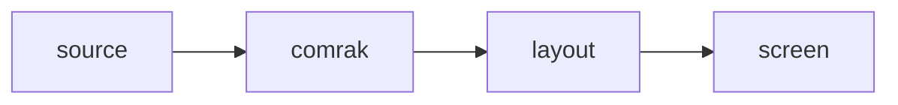

# mdroll

A terminal Markdown viewer with **big headings** and real *GitHub Flavored
Markdown* — tables, task lists, footnotes, `> [!NOTE]` alerts, mermaid
diagrams, and inline images, all in the terminal you already have.


## Pipeline



## What it renders

| Construct | Key | Notes |
| --- | :---: | --- |
| Tables | | Column widths in display columns, so 日本語 lines up |
| Images | `i` | Kitty graphics, cropped as they scroll |
| Source view | `s` | One logical line per row, for copying |
| Contents | `T` | Every heading, as links |

- [x] UAX #14 line breaking with kinsoku
- [x] OSC 8 hyperlinks and [clickable links](https://example.com)
- [x] Rasterized headings where DECDHL is unavailable

> [!NOTE]
> The headings above are bitmaps: kitty has graphics but no DECDHL, so they
> are rasterized. On WezTerm the same headings use DECDHL instead.

```rust
fn layout(doc: &Document, view: Viewport, opts: &Options) -> Vec<Line> {
    // A pure function: toggling a mode just calls it again.
    doc.blocks.iter().flat_map(|b| b.render(view, opts)).collect()
}
```
