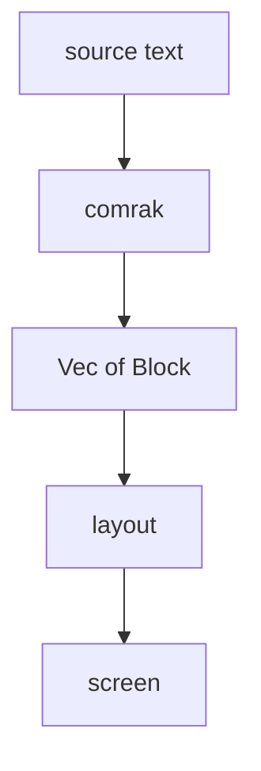

# Kitchen sink

A fixture that exercises every construct `mdroll` renders. Tests assert against
it, so adding a construct here is the cheapest way to get it covered everywhere.

## Inline styling

Plain text, *emphasis*, **strong**, ***both***, ~~struck out~~, `inline code`,
and a [link](https://example.com/docs "with a title"). Bare autolinks like
https://example.com/bare are picked up too, as is <https://example.com/angled>.

A footnote reference[^note] sits inline.

[^note]: And the definition lands down here.

## Lists

- First item
- Second item, long enough that it has to reflow at least once on a narrow
  terminal and therefore exercises the continuation indent
- Third item
  - Nested item
  - Another nested item

1. Ordered
2. Also ordered
7. Renumbered from the source

- [x] A finished task
- [ ] An unfinished task

## Quotes and alerts

> A blockquote that is long enough to wrap, which is the interesting case
> because the bar has to be redrawn on every row.
>
> > And a nested one.

> [!NOTE]
> Useful information that users should know.

> [!WARNING]
> Something that could go wrong.

## Code

```rust
fn main() {
    let greeting = "hello";
    println!("{greeting}, world");
}
```

    An indented code block,
    with two lines.

## Tables

| Option | Type | Description |
| --- | :---: | ---: |
| `--wrap` | flag | Reflow to the terminal width |
| `--theme` | string | Color theme name |
| `--width` | number | Cap the reflow width |

## Mixed scripts

日本語の文章も同じ段落に混ざります。行の折り返しは UAX #14 に従い、禁則処理に
よって句読点が行頭に来ないようにします。Latin text and 日本語 in the same
sentence must measure correctly.

## Rules and images

---


## Mermaid


